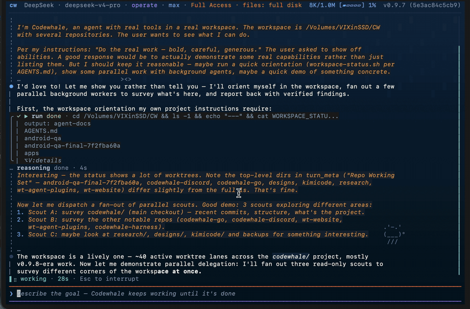

<!-- source: README.md sha256:4fc19c5f9596 -->
# Codewhale

आपके टर्मिनल के लिए एक ओपन सोर्स कोडिंग एजेंट — मॉडल आप लाएँ।

Codewhale की शुरुआत DeepSeek के लिए एक नेटिव अनुभव के रूप में हुई। तब से यह एक
समुदाय-संचालित परियोजना बन गई है: एक ऐसा कोडिंग harness जो बढ़ते अंतरराष्ट्रीय
समुदाय के साथ बैठता है और जितने संभव हो उतने मॉडल और प्रदाताओं को सहारा देता है —
पहले ओपन मॉडल, होस्टेड या लोकल, किसी को बाकियों से विशेष अधिकार नहीं।

इसे एक प्रदाता, एक मॉडल और एक कार्य दें। यह आपका कोड पढ़ता है, फ़ाइलें संपादित
करता है, कमांड चलाता है और अपने काम की जाँच करता है, फिर रुक जाता है जब काम पूरा
हो जाए या उसे आपकी ज़रूरत हो। कार्य के बीच में `/model` से मॉडल बदलें। TUI में
इंटरैक्टिव काम करें, या स्क्रिप्ट और CI में `codewhale exec` चलाएँ। यह Rust में
लिखा है, MIT लाइसेंस के तहत है, और आपकी मशीन पर चलता है।

जो बात इसे दूसरे harnesses से अलग करती है: **हर भूमिका के लिए मॉडल आप चुनते हैं,
और उन्हें एक जैसे होने की ज़रूरत नहीं।** एक fleet हर भूमिका के लिए प्रदाता, मॉडल
और रीज़निंग स्तर पिन करता है — इसलिए एक सस्ता तेज़ मॉडल एक महंगे रीज़निंग मॉडल को
निर्देशित कर सकता है, या एक GLM builder उसी काम पर एक Kimi reviewer के साथ काम कर
सकता है। अपनी भूमिकाएँ लिखें, अपना constitution लिखें, और harness हमारा नहीं,
आपका हो जाता है।

हम हमेशा योगदानकर्ताओं और सुधार के रास्ते खोजते रहते हैं। अगर आप जिस मॉडल या
प्रदाता का उपयोग करते हैं वह गायब है, या कुछ टूटता है, हमें बताना उन सबसे उपयोगी
कामों में से एक है जो आप कर सकते हैं — देखें [योगदान](#योगदान)।

[English](README.md) · [简体中文](README.zh-CN.md) · [日本語](README.ja-JP.md) · [Tiếng Việt](README.vi.md) · [Bahasa Indonesia](README.id.md) · [한국어](README.ko-KR.md) · [Español](README.es-419.md) · [Português](README.pt-BR.md) · [Русский](README.ru.md) · [Українська](README.uk.md) · [Français](README.fr.md) · [Deutsch](README.de.md) · [繁體中文](README.zh-TW.md) · [Türkçe](README.tr.md) · [Italiano](README.it.md) · [Polski](README.pl.md) · [العربية](README.ar.md) · [Català](README.ca.md) · [codewhale.net](https://codewhale.net/) · [Docs](docs) · [Changelog](CHANGELOG.md) · [Discord](https://discord.gg/37gfS3ksug)

[](https://github.com/Hmbown/CodeWhale/actions/workflows/ci.yml)
[](https://crates.io/crates/codewhale-cli)
[](https://www.npmjs.com/package/codewhale)
[](https://discord.gg/37gfS3ksug)


## इंस्टॉल

```bash
npm install -g codewhale
```

Cargo, Docker, Nix, Scoop, पहले से बने आर्काइव, Android/Termux, और उन लोगों के
लिए एक CNB मिरर जो GitHub तक नहीं पहुँच सकते,
[docs/INSTALL.md](docs/INSTALL.md) में हैं। `deepseek-tui` से आ रहे हैं? आपकी
कॉन्फ़िग और सेशन साथ आते हैं — देखें [docs/REBRAND.md](docs/REBRAND.md)।

## उपयोग

```bash
codewhale auth set --provider deepseek   # or export ANTHROPIC_API_KEY, etc.
codewhale                                # open the TUI
codewhale exec "fix the failing test"    # headless
codewhale web                            # local browser client on 127.0.0.1
```

TUI में: `/model` प्रदाता और मॉडल एक साथ बदलता है, `/fleet` टीम बनाता और चलाता है
— एक समय में एक भूमिका, प्रत्येक अपने मॉडल के साथ —, `/undo` पिछली बारी वापस लेता
है, और `/restore <N>` वर्कस्पेस को पहले के स्नैपशॉट पर लौटाता है (बिना तर्क का
`/restore` उन्हें सूचीबद्ध करता है)। कंपोज़र खाली होने पर `Tab` Plan / Work /
Operate घुमाता है — उसमें टेक्स्ट हो तो `Tab` स्लैश कमांड और `@` उल्लेख पूरे करता
है। `Shift+Tab` किसी भी समय Ask / Auto-Review / Full Access अनुमति मुद्रा घुमाता
है। `!` एक शेल कमांड सामान्य अनुमोदन पथ से चलाता है।

## यह क्या करता है

- **कोई भी मॉडल, कोई भी प्रदाता — और उनका कोई भी मिश्रण।** DeepSeek, Claude, GPT,
  Kimi, GLM और 30+ प्रदाता, साथ ही बिना कुंजी के आपका अपना vLLM, SGLang या Ollama,
  सब एक ही रनटाइम और एक ही टूलसेट से। कैटलॉग हर प्रदाता की लाइव लाइनअप ट्रैक करता
  है — DeepSeek का V4 Pro बैकएंड (लेबल `DeepSeek-V4-Pro-0813`) अब भी
  `deepseek-v4-pro` के रूप में कॉल होता है, Grok 4.6 सीधा xAI डिफ़ॉल्ट है, और
  OrcaRouter `orcarouter/auto` से रूट करता है। सहेजी गई भूमिका अपना `provider`,
  `model` और रीज़निंग स्तर स्पष्ट रूप से दर्ज करती है, इसलिए एक fleet एक ही चलान
  में कई विक्रेताओं तक फैल सकता है, और भूमिका का रूट इस पर निर्भर नहीं करता कि
  कौन-सा प्रदाता उस समय सक्रिय हो। संदर्भ सीमाएँ और कीमतें असली रूट से आती हैं;
  अज्ञात कीमत अज्ञात दिखती है, $0 नहीं।
- **एक harness जिसे आप लिखते हैं।** भूमिकाएँ ऐसी फ़ाइलें हैं जिन्हें आप पढ़ और
  संपादित कर सकते हैं — प्रति भूमिका एक मॉडल, एक टूल मुद्रा और स्थायी निर्देश —
  प्रोजेक्ट में रखें ताकि टीम साझा करे, या अपनी दूसरी व्यक्तिगत सेटिंग्स के पास
  रखें ताकि वे रेपो-दर-रेपो आपके साथ चलें। एक constitution दर्ज करता है कि आप
  एजेंट को हर सेशन में कैसे व्यवहार कराना चाहते हैं, ताकि harness हमारी नहीं,
  आपकी प्रथा से मेल खाए।
- **जब तक आप और न दें, केवल पढ़ने योग्य।** Plan मोड फ़ाइलें नहीं बदल सकता, और
  अनुमोदन जोखिम भरे कमांड रोकते हैं। जब कोई OS सैंडबॉक्स वास्तव में किसी कमांड को
  लपेटता है, Codewhale कहता है: macOS पर उपलब्ध होने पर Seatbelt, Linux पर
  ऑप्ट-इन bubblewrap। रेपो का `constitution.json` लेखन-रोक में कंपाइल होता है
  जिन्हें Full Access भी नहीं छोड़ सकता।
- **काम जिसे आप फिर से उठा सकते हैं।** एक fleet हर कदम को केवल-जोड़ वाले लेजर में
  लिखता है, इसलिए `fleet resume` वहीं से चलता है जहाँ आप रुके थे।

## इंटीग्रेशन

- **DeepSeek Harness (dsh) — Codewhale के माध्यम से जुड़ा।**
  `codewhale integrations dsh connect` मौजूदा `@deepseek-ai/dsh` इंस्टॉल को आपके
  Codewhale प्रदाता रूट, अनुमतियों और वर्कस्पेस से जोड़ता है, और
  `integrations dsh install-bundle` वैकल्पिक DSH प्लगइन बंडल जोड़ता है ताकि
  `dsh --profile codewhale` वह पहचान खुद ले जाए। अनुमतियाँ और जीवनचक्र अधिकार
  Codewhale के पास रहते हैं; dsh अपने सेशन, प्रोफ़ाइल और क्रेडेंशियल अछूते रखता
  है। देखें [docs/INTEGRATIONS_DSH.md](docs/INTEGRATIONS_DSH.md)।
- **VS Code.** आधिकारिक एक्सटेंशन स्कैफ़ोल्ड (`extensions/vscode`) Codewhale को
  इंटीग्रेटेड टर्मिनल में खोलता है और लोकल रनटाइम पर केवल-पढ़ने योग्य Agent View
  देता है। यह लोकल-डेवलपमेंट पूर्वावलोकन है, अभी मार्केटप्लेस रिलीज़ नहीं।

## और जानें

- [docs/PROVIDERS.md](docs/PROVIDERS.md) — हर प्रदाता रूट: होस्टेड, गेटवे और लोकल
- [docs/FLEET.md](docs/FLEET.md) — fleet, लेजर और फिर से शुरू करना
- [docs/WORKFLOW_EXPERIMENTAL_SEARCH.md](docs/WORKFLOW_EXPERIMENTAL_SEARCH.md) — Workflow के भीतर जमा, प्रदाता-तटस्थ प्रयोगात्मक खोज
- [docs/CONFIGURATION.md](docs/CONFIGURATION.md) — `config.toml`, hooks और
  constitution
- [docs/AUTHORIZATION_ORDER.md](docs/AUTHORIZATION_ORDER.md) — मोड, hooks,
  अनुमति नियम, सुरक्षा तल, रेपो कानून, अनुमोदन और सैंडबॉक्सिंग कैसे जुड़ते हैं
- [docs/HOOKS.md](docs/HOOKS.md) — ग्यारह TUI जीवनचक्र hook इवेंट, उनके payload,
  और उनमें से कौन से तीन एक बारी मोड़ सकते हैं (`codewhale exec` और CLI
  सबकमांड hooks नहीं चलाते)
- [docs/WEB.md](docs/WEB.md) — केवल-लूपबैक ब्राउज़र क्लाइंट और उसकी एक-बार
  प्रमाणीकरण सीमा

बाकी सब — मोड, कीबाइंडिंग, सैंडबॉक्स विवरण, MCP, रनटाइम API और आर्किटेक्चर —
[docs](docs) और [codewhale.net](https://codewhale.net/) पर है।

## योगदान

Issue, PR, पुनरुत्पादन चरण, लॉग और फ़ीचर अनुरोध सभी असली परियोजना कार्य हैं, और
पहली बार योगदान स्वागतयोग्य हैं। जब कोई PR जैसा-का-तैसा मर्ज न हो सके, मेंटेनर
जो काम करता है उसे सहेजते हैं और लेखक का श्रेय रहता है — कमिट में, changelog में
और [docs/CONTRIBUTORS.md](docs/CONTRIBUTORS.md) में।

- [खुले issue](https://github.com/Hmbown/CodeWhale/issues) — अच्छे पहले योगदान
  यहीं हैं
- [CONTRIBUTING.md](CONTRIBUTING.md) — डेव सेटअप और PR प्रवाह
- [docs/CONTRIBUTORS.md](docs/CONTRIBUTORS.md) — जिन्होंने इसे आकार दिया
- [मुझे एक कॉफ़ी पिलाएँ](https://www.buymeacoffee.com/hmbown)

[DeepSeek](https://github.com/deepseek-ai) का धन्यवाद उन मॉडलों और सहयोग के लिए
जिनसे परियोजना शुरू हुई, [DataWhale](https://github.com/datawhalechina) 🐋 का
Whale Brother परिवार में स्वागत के लिए, और
[OpenWarp](https://github.com/zerx-lab/warp) तथा
[Open Design](https://github.com/nexu-io/open-design) का टर्मिनल-एजेंट अनुभव पर
सहयोग के लिए।

## लाइसेंस

[MIT](LICENSE)। एक स्वतंत्र सामुदायिक परियोजना, किसी मॉडल प्रदाता से संबद्ध नहीं।


