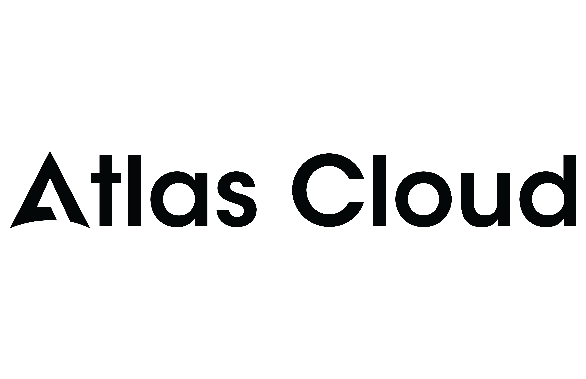

# CodeWhale

> The terminal coding agent for any model — open models first.

A Rust TUI and CLI, 25 providers. DeepSeek, OpenRouter, Hugging Face,
DeepInfra, and local vLLM/SGLang/Ollama are first-class routes, and CodeWhale
speaks natively to Anthropic Claude and OpenAI when that's what you have.
Approval-gated tools, OS sandboxing, and `/restore` rollback for every turn.

[简体中文 README](README.zh-CN.md) · [日本語 README](README.ja-JP.md) · [Tiếng Việt README](README.vi.md) · [codewhale.net](https://codewhale.net/) · [Install guide](docs/INSTALL.md) · [Provider registry](docs/PROVIDERS.md) · [Changelog](CHANGELOG.md)

[](https://github.com/Hmbown/CodeWhale/actions/workflows/ci.yml)
[](https://crates.io/crates/codewhale-cli)
[](https://www.npmjs.com/package/codewhale)
[](https://deepwiki.com/Hmbown/CodeWhale)


---

## Atlas Cloud — OpenAI-compatible LLM Backend



[Atlas Cloud](https://www.atlascloud.ai/?utm_source=github&utm_medium=link&utm_campaign=DeepSeek-TUI) is an OpenAI-compatible inference platform that lets you plug 59+ curated LLM models into CodeWhale without changing a single line of code — just swap `base_url` and `api_key`. It gives DeepSeek-TUI users a single API entry point covering DeepSeek V4 Pro/Flash, Qwen, GLM, Kimi, MiniMax, Mistral, and more, with no per-provider SDK juggling.

**Why Atlas Cloud with CodeWhale?**
- Drop-in replacement for the DeepSeek native API — same OpenAI SDK format, same `--provider atlascloud` flag
- 59+ curated open models in one key: DeepSeek, Qwen, GLM, Kimi, MiniMax, Llama, Mistral, …
- Budget-friendly [Coding Plan](https://www.atlascloud.ai/console/coding-plan) designed for agentic, long-context coding sessions

**Quick setup:**

```bash
# Authenticate with Atlas Cloud provider
codewhale auth set --provider atlascloud --api-key <your-atlascloud-key>

# Start a session using DeepSeek V4 Pro via Atlas Cloud
codewhale --provider atlascloud --model deepseek-ai/deepseek-v4-pro
```

Or via environment variables:

```env
DEEPSEEK_PROVIDER=atlascloud
ATLASCLOUD_API_KEY=<your-atlascloud-key>
ATLASCLOUD_BASE_URL=https://api.atlascloud.ai/v1
ATLASCLOUD_MODEL=deepseek-ai/deepseek-v4-pro
```

> **Important:** `deepseek-ai/deepseek-v4-pro` is a reasoning model. Always set `max_tokens >= 512` (or leave unset to use the default) to avoid empty responses.

Get a free API key and explore the [Coding Plan promotion](https://www.atlascloud.ai/console/coding-plan).

<details>
<summary>59 models available on Atlas Cloud</summary>

| Model | Provider | Type |
|---|---|---|
| `deepseek-ai/deepseek-v4-pro` | DeepSeek | Reasoning LLM |
| `deepseek-ai/deepseek-v4-flash` | DeepSeek | Fast LLM |
| `deepseek-ai/deepseek-r2` | DeepSeek | Reasoning LLM |
| `deepseek-ai/deepseek-prover-v2` | DeepSeek | Math/Reasoning |
| `deepseek-ai/deepseek-v3-0324` | DeepSeek | LLM |
| `deepseek-ai/deepseek-r1` | DeepSeek | Reasoning LLM |
| `deepseek-ai/deepseek-r1-distill-qwen-32b` | DeepSeek | Distill |
| `deepseek-ai/deepseek-r1-distill-qwen-14b` | DeepSeek | Distill |
| `deepseek-ai/deepseek-r1-distill-llama-70b` | DeepSeek | Distill |
| `deepseek-ai/deepseek-r1-distill-qwen-7b` | DeepSeek | Distill |
| `qwen/qwen3-235b-a22b` | Alibaba | MoE LLM |
| `qwen/qwen3-32b` | Alibaba | LLM |
| `qwen/qwen3-30b-a3b` | Alibaba | MoE LLM |
| `qwen/qwen3-14b` | Alibaba | LLM |
| `qwen/qwen3-8b` | Alibaba | LLM |
| `qwen/qwen2.5-72b-instruct` | Alibaba | LLM |
| `qwen/qwen2.5-32b-instruct` | Alibaba | LLM |
| `qwen/qwen2.5-coder-32b-instruct` | Alibaba | Code LLM |
| `qwen/qwq-32b` | Alibaba | Reasoning LLM |
| `qwen/qvq-72b-preview` | Alibaba | Vision LLM |
| `thudm/glm-4-32b` | Zhipu AI | LLM |
| `thudm/glm-z1-32b` | Zhipu AI | Reasoning LLM |
| `thudm/glm-4-9b-chat` | Zhipu AI | LLM |
| `moonshot/moonshot-v1-32k` | Moonshot | Long-ctx LLM |
| `moonshot/moonshot-v1-128k` | Moonshot | Long-ctx LLM |
| `moonshot/kimi-k2` | Moonshot | Agentic LLM |
| `minimax/minimax-text-01` | MiniMax | LLM |
| `minimax/abab7-chat-preview` | MiniMax | LLM |
| `meta-llama/llama-3.3-70b-instruct` | Meta | LLM |
| `meta-llama/llama-3.1-70b-instruct` | Meta | LLM |
| `meta-llama/llama-3.1-8b-instruct` | Meta | LLM |
| `meta-llama/meta-llama-3-70b-instruct` | Meta | LLM |
| `mistralai/mistral-large-2411` | Mistral | LLM |
| `mistralai/mistral-small-3.1-24b-instruct` | Mistral | LLM |
| `mistralai/codestral-2501` | Mistral | Code LLM |
| `mistralai/mistral-7b-instruct` | Mistral | LLM |
| `mistralai/mixtral-8x7b-instruct` | Mistral | MoE LLM |
| `mistralai/mixtral-8x22b-instruct` | Mistral | MoE LLM |
| `google/gemma-3-27b-it` | Google | LLM |
| `google/gemma-3-12b-it` | Google | LLM |
| `google/gemma-3-4b-it` | Google | LLM |
| `google/gemma-2-27b-it` | Google | LLM |
| `google/gemma-2-9b-it` | Google | LLM |
| `01-ai/yi-1.5-34b-chat` | 01.AI | LLM |
| `01-ai/yi-1.5-9b-chat` | 01.AI | LLM |
| `baichuan-inc/baichuan2-13b-chat` | Baichuan | LLM |
| `internlm/internlm2_5-7b-chat` | InternLM | LLM |
| `internlm/internlm2_5-20b-chat` | InternLM | LLM |
| `tencent/hunyuan-turbo` | Tencent | LLM |
| `tencent/hunyuan-standard-256k` | Tencent | Long-ctx LLM |
| `stepfun/step-2-16k` | StepFun | LLM |
| `stepfun/step-1-32k` | StepFun | LLM |
| `bge-m3` | BAAI | Embedding |
| `bge-reranker-v2-m3` | BAAI | Reranker |
| `claude-3-5-sonnet-20241022` | Anthropic | LLM |
| `claude-3-haiku-20240307` | Anthropic | LLM |
| `gpt-4o` | OpenAI | LLM |
| `gpt-4o-mini` | OpenAI | LLM |
| `o1-mini` | OpenAI | Reasoning LLM |

</details>

---

## Install

```bash
npm install -g codewhale
codewhale --version   # 0.8.61
```

The npm wrapper (Node 18+) downloads SHA-256-verified binaries from GitHub
Releases and installs `codewhale`, `codew`, and `codewhale-tui`. Prefer
building from source? Use cargo (Rust 1.88+):

```bash
cargo install codewhale-cli --locked
cargo install codewhale-tui --locked
```

> **Linux users:** install system build dependencies first:
> `sudo apt-get install -y build-essential pkg-config libdbus-1-dev`.
> See [INSTALL.md](docs/INSTALL.md#4-install-via-cargo-any-tier-1-rust-target).

Every other path:

```bash
# Docker
docker pull ghcr.io/hmbown/codewhale:latest

# Nix
nix run github:Hmbown/CodeWhale

# Windows
scoop install codewhale        # or the NSIS installer from GitHub Releases

# CNB mirror for users who cannot reliably reach GitHub
cargo install --git https://cnb.cool/codewhale.net/codewhale --tag v0.8.61 codewhale-cli --locked --force
cargo install --git https://cnb.cool/codewhale.net/codewhale --tag v0.8.61 codewhale-tui --locked --force

# Legacy Homebrew compatibility while the formula is renamed
brew tap Hmbown/deepseek-tui
brew install deepseek-tui
```

Prebuilt archives for every platform — including Linux riscv64 — are attached
to [GitHub Releases](https://github.com/Hmbown/CodeWhale/releases). Checksums,
China mirrors, Windows specifics, and troubleshooting live in
[docs/INSTALL.md](docs/INSTALL.md).

**Upgrading from the legacy `deepseek-tui` package?** Your config, sessions,
skills, and MCP settings are preserved. See [docs/REBRAND.md](docs/REBRAND.md),
then run `codewhale doctor` to confirm.

## First Run

```bash
codewhale auth set --provider deepseek
codewhale auth status
codewhale doctor
codewhale
```

Every provider is the same one-line shape: `--provider openrouter`,
`--provider moonshot`, or point `vllm`, `sglang`, or `ollama` at your own
localhost runtime with no key at all. Have a Claude key instead? Run
`codewhale auth set --provider anthropic` — or just export
`ANTHROPIC_API_KEY` — and the native Messages adapter takes it from there.

Keys land in `~/.codewhale/config.toml`; legacy `~/.deepseek/` config is still
read for compatibility.

Useful in-session commands:

- `/provider` and `/model` switch the route and model mid-session.
- `/restore` rolls back a prior turn from side-git snapshots.
- `/skills` loads reusable workflows from `~/.codewhale/skills/`.
- `/config` edits runtime settings; `/statusline` shows the current route,
  cost, and session state.
- `! cargo test -p codewhale-tui` runs any shell command through the normal
  approval and sandbox path.

Headless, for scripts and CI:

```bash
codewhale exec --allowed-tools read_file,exec_shell --max-turns 10 "fix the failing test"
```

## What Ships

A terminal-native agent harness — TUI + CLI, 16 Rust crates — where the safety
rails are runtime mechanisms, not advice the model has to remember:

- **Approval-gated tools with OS sandboxing.** File, shell, git, web, MCP, and
  sub-agent tools run behind explicit approval gates and sandbox backends
  (bwrap, Landlock, Seatbelt, seccomp).
- **Rollback you can trust.** Side-git snapshots and `/restore`, kept outside
  your repo's `.git` — undoing a turn never touches your history.
- **Hooks v2** *(0.8.58)*. `tool_call_before` hooks return JSON
  `allow`/`deny`/`ask` decisions with deny-wins precedence, glob matchers, and
  project-local `.codewhale/hooks.toml`.
- **Concurrent sub-agents with provider-aware routing** *(0.8.58)*. Parallel
  investigation and implementation, with big/cheap model tiers resolved per
  provider — no hardcoded model ids.
- **Durable sessions.** Forks, relay handoffs, and a cross-session
  disk-backed prompt cache that stays byte-stable across Plan/Agent/YOLO mode
  flips *(0.8.56)*. Turns survive system sleep *(0.8.57)*: suspend mid-stream,
  wake, and the request is silently re-issued instead of failing the turn.
- **Headless mode.** `codewhale exec` with `--allowed-tools`,
  `--disallowed-tools` (deny wins), `--max-turns`, and
  `--append-system-prompt` *(0.8.58)* for scripts and CI.
- **Embedded everywhere.** HTTP/SSE and ACP runtime APIs, a VS Code extension
  (Phase 0), and Telegram/Feishu bridges (Weixin bridge experimental).
- **Daily-driver polish.** MCP client *and* server, reusable skills, 7-locale
  localization (approval dialogs included since 0.8.56), and speech/TTS via
  Xiaomi MiMo.

### Any model, open models first

Twenty-five providers route through the same harness, same constitution, same
tools:

- **Open models, hosted:** `deepseek` (first among equals), `openrouter`,
  `huggingface` (Inference Providers), `moonshot` (Kimi), `zai` (GLM),
  `minimax`, `volcengine` (Ark), `nvidia-nim`, `together`, `fireworks`,
  `novita`, `siliconflow` / `siliconflow-CN`, `arcee`, `xiaomi-mimo`,
  `deepinfra`, `stepfun`, `atlascloud`, `wanjie-ark`, plus a generic `openai`-compatible
  route for any gateway.
- **Open models, self-hosted:** `vllm`, `sglang`, and `ollama` against your
  own localhost endpoints — no key required.
- **Closed providers, natively:** `anthropic` through a dedicated
  `/v1/messages` adapter *(0.8.58)* with adaptive thinking, prompt-cache
  breakpoints, and signed-thinking replay — not an OpenAI-dialect shim — and
  `openai-codex`, which reuses an existing ChatGPT/Codex CLI login.

Routing is more than a base URL swap: `/reasoning` effort is translated into
each provider's wire dialect, sub-agent tiers resolve per provider, and the
system prompt's model facts are templated per-model instead of hardcoded
*(0.8.58)*. Switch mid-session with `/provider` and `/model`. The full
registry — credentials, base URLs, capability boundaries — lives in
[docs/PROVIDERS.md](docs/PROVIDERS.md).

The version tags above mark what landed in the last three releases
(0.8.56 → 0.8.58). Full details in [CHANGELOG.md](CHANGELOG.md).

## The Idea — mission idea put in this version

Most coding agents start by adding power: more tools, more context, more
autonomy. CodeWhale starts by assigning responsibility.

An agent that edits your repo should have an address — this terminal, this
user, this branch, this session. Not a persona; a return address. When
something breaks, "the model did it" is not an answer. "This instance, in this
session, after this approval" is.

*(This is the design mission being put in place in this version. The exact
shape — especially memory, cost accounting, and remote orchestration — is
still iterating; see the v0.9.0 track below.)*

Then it needs law. A real working session is a conflict stack: your current
request, the repo's instructions, fresh shell output, stale memory, and a
previous agent's handoff all compete inside the same turn. The **CodeWhale
Constitution** fixes the order of authority:

1. **User intent is sovereign.** Your current request outranks stale repo
   guidance, memory, previous handoffs, and personality overlays.
2. **Repo law is explicit.** Add `.codewhale/constitution.json` to declare
   durable project authority: protected invariants, branch policy,
   verification rules.
3. **Evidence outranks narration.** Tool output beats a confident guess. A
   failed `cargo test` is reported as a failed `cargo test`, never summarized
   into optimism. Verification is part of the task, not an epilogue.
4. **Memory comes last.** Useful, never authoritative.

The policy that matters is enforced in code, not prompted: approval gates,
sandboxing, snapshots, rollback, and tool schemas are runtime mechanisms the
model cannot talk its way around.

And none of that law lives in the model — which is why the model is swappable.
The harness carries the constitution; the model supplies the reasoning.
DeepSeek and the open-weight world are first-class citizens, a box on your LAN
running vLLM or Ollama is a full peer, and when what you have is a Claude or
OpenAI key, CodeWhale speaks those APIs natively too.

That is the product: not a bigger model, but a stricter harness around
whichever model you choose. Swap the model; the law holds.

## Where Details Live

The README carries the idea and the first path. The details live in docs and on
[codewhale.net](https://codewhale.net/):

- [User guide](docs/GUIDE.md) — first hour with CodeWhale.
- [Install guide](docs/INSTALL.md) — every package path and troubleshooting.
- [Configuration](docs/CONFIGURATION.md) — config files, repo constitution, and
  provider settings.
- [Provider registry](docs/PROVIDERS.md) — model routes, credentials, base URLs,
  and capability boundaries.
- [Modes](docs/MODES.md) — Agent, Plan, and YOLO.
- [Sub-agents](docs/SUBAGENTS.md) — roles, lifecycle, output contract, and
  recovery behavior.
- [Fleet](docs/FLEET.md) — multi-worker runs and headless orchestration.
- [WhaleFlow authoring](docs/WHALEFLOW_AUTHORING.md) — declarative workflows.
- [MCP](docs/MCP.md) — connecting external tool servers and running CodeWhale
  as an MCP server itself.
- [Runtime API](docs/RUNTIME_API.md) — HTTP/SSE, ACP, mobile, and GUI/editor
  integration contracts.
- [Model Lab](docs/MODEL_LAB.md) — open-model discovery and evaluation roadmap.
- [Architecture](docs/ARCHITECTURE.md) — crate layout, runtime flow, tool system,
  extension points, and security model.
- [Keybindings](docs/KEYBINDINGS.md) · [Sandbox & approvals](docs/SANDBOX.md)
  · [Accessibility](docs/ACCESSIBILITY.md) · [Docker](docs/DOCKER.md)
  · [Memory](docs/MEMORY.md)
- [Full docs index](docs) — everything else.

## v0.9.0 Track

v0.9.0 is the current integration lane. The work gathering there:

- stronger relay and handoff surfaces between sessions and agents;
- calmer transcripts for dense tool runs;
- runtime APIs for VS Code and GUI clients;
- WhaleFlow branch/leaf workflow orchestration.

Release-by-release details live in [CHANGELOG.md](CHANGELOG.md).

## Community & Contributing

CodeWhale is built in the open — and that's the point. The goal is simple: with
the most eyes and the most hands, build the best agent harness for the most
people. What started as one person's DeepSeek-inspired side project has been
shaped by a community into something bigger than its original intent could have
imagined.

**We love issues and pull requests, regardless of how experienced you feel.** Bug
reports, feature ideas, docs fixes, "first PR"s, and curious questions all count
as real project work. Maintainers treat reports and PRs as contributions even
when the final patch has to be narrowed, delayed, or folded into a maintainer
commit — and recurring contributors stay credited in the public record.

- [Open issues](https://github.com/Hmbown/CodeWhale/issues) — good first
  contributions live here.
- [CONTRIBUTING.md](CONTRIBUTING.md) — set up a dev loop and open a PR.
- [Code of Conduct](CODE_OF_CONDUCT.md) — be excellent to each other.
- [Contributors](docs/CONTRIBUTORS.md) — the people who've shaped CodeWhale.

The maintainer posture is to keep that door open while protecting release
quality:

- Issues should stay human-readable and actionable. Intake automation is
  advisory unless a maintainer deliberately enables enforcement.
- PRs are reviewed from code, tests, linked issues, and runtime behavior, not
  from title alone.
- If a PR is too broad to merge directly, maintainers may harvest the safe part
  into a narrower branch, then credit the author and explain what landed.
- Co-author trailers should use mappable GitHub noreply identities from
  `.github/AUTHOR_MAP`; reporters and repro authors are thanked in changelogs,
  release notes, and closure comments.
- Recurring contributors can be added to `.github/APPROVED_CONTRIBUTORS` so
  dry-run gates stay out of their way.

Support: [Buy me a coffee](https://www.buymeacoffee.com/hmbown).

## Thanks

CodeWhale exists because of the people who use it, break it, and fix it.

- **[DeepSeek](https://github.com/deepseek-ai)** — the models and support that
  got this project started. 感谢 DeepSeek 提供模型与支持。
- **[DataWhale](https://github.com/datawhalechina)** 🐋 — for the support and for
  welcoming us into the Whale Brother family. 感谢 DataWhale 的支持。
- **[OpenWarp](https://github.com/zerx-lab/warp)** and
  **[Open Design](https://github.com/nexu-io/open-design)** — for collaborating
  on a better terminal-agent experience.
- **Every contributor** — the full per-PR record lives in
  [docs/CONTRIBUTORS.md](docs/CONTRIBUTORS.md). Thank you.

## License

[MIT](LICENSE)

> *CodeWhale is an independent community project and is not affiliated with any
> model provider.*

## Star History

[](https://www.star-history.com/?repos=Hmbown%2FCodeWhale&type=date&logscale=&legend=top-left)
