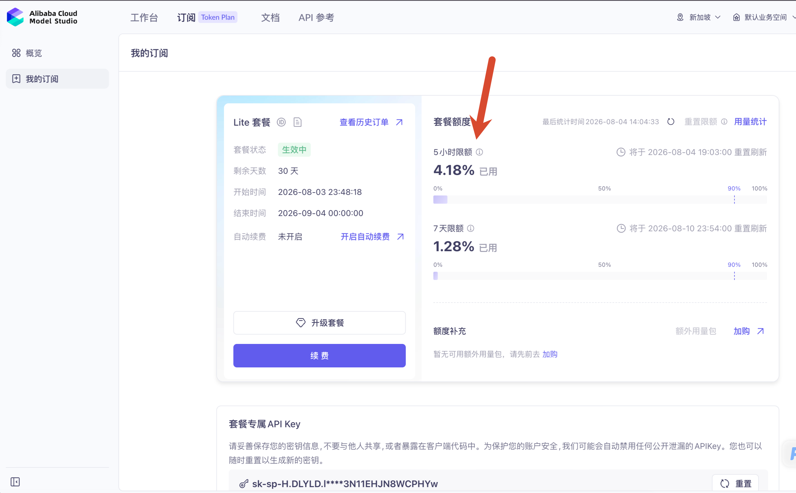
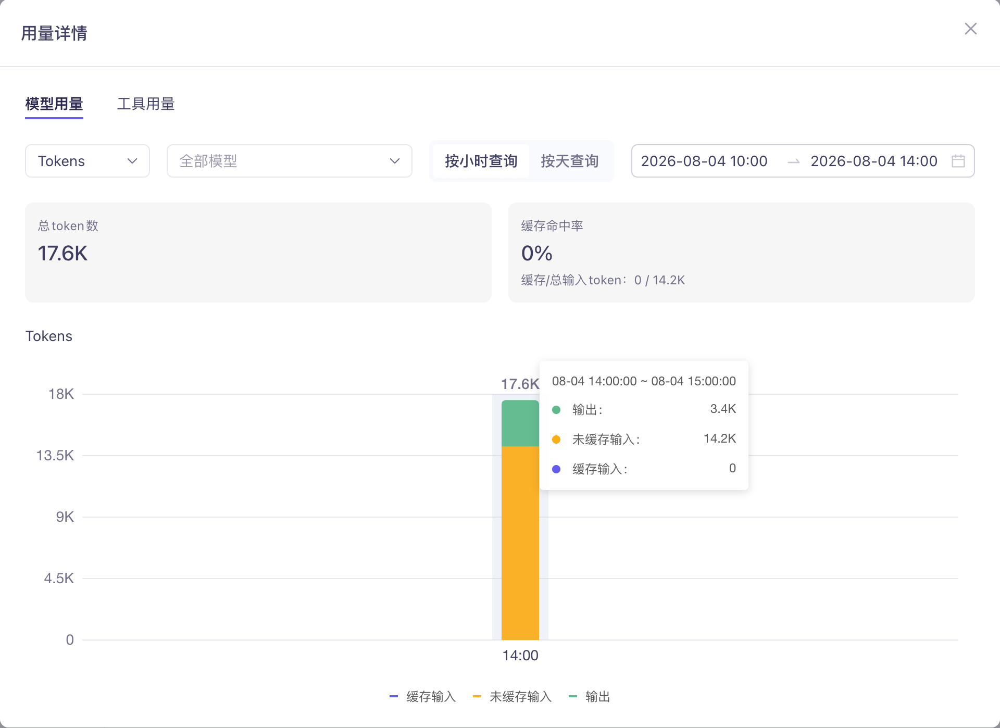

# Model Studio reasoning evidence — #5203

This record is deliberately credential-free. The validation process used an
environment-only `MODELSTUDIO_API_KEY`; no API key, workspace id, raw HTTP
authorization header, or full provider reasoning trace is committed here.

## Scope and result

On 2026-08-04, a real Alibaba Cloud Model Studio **Token Plan Lite** request
using `qwen3.8-max` completed in the local CodeWhale TUI. The model's
`reasoning_content` rendered in the dedicated Thinking cell, and the final
answer remained a separate assistant message.

The evidence below replaces the earlier terminal stills with three artifacts
from that validation: a 32.9-second local Terminal recording, the Model Studio
subscription page, and the Model Studio usage details for the same validation
window. None contains an API key.

## Live streaming recording

[Download the local Terminal recording (MP4, 32.9 seconds)](modelstudio-token-plan-live-streaming-5203.mp4)

The recording identifies the active provider as **Alibaba Cloud Model Studio**
and the model as **qwen3.8-max**. It begins in a dedicated `reasoning` state
with a separate `… reasoning hidden` marker, transitions to the `working`
response phase, streams the Redis cache-invalidation response, and ends with a
completed state. This is a direct macOS Terminal capture, not a GIF or a
synthetic replay.

## Model Studio account-side evidence



The subscription page shows that the Token Plan Lite subscription was active
and that the five-hour quota had recorded consumption after the validation.



The usage-details page records **17.6K total tokens** in the 14:00–15:00
window: **14.2K uncached input tokens** and **3.4K output tokens**. This is
provider-side corroboration that the live validation reached Model Studio; it
does not expose request contents or credentials.

## Endpoint and wire-contract matrix

| Route | OpenAI-compatible Base URL | Evidence in this change | Result |
| --- | --- | --- | --- |
| Token Plan | `https://token-plan.ap-southeast-1.maas.aliyuncs.com/compatible-mode/v1` | Live Token Plan Lite TUI recording + account-side usage evidence | Thinking displayed |
| Workspace-scoped Model Studio | `https://{workspace}.{region}.maas.aliyuncs.com/compatible-mode/v1` | Route regression test | Accepted only for the documented host/path shape |
| Coding Plan | `https://coding-intl.dashscope.aliyuncs.com/v1` | Route regression test | Primary `modelstudio-token-plan` identity plus `mode = "coding-plan"` receives the same reasoning contract |
| Anthropic Messages | `https://token-plan.ap-southeast-1.maas.aliyuncs.com/apps/anthropic` | Not changed by this PR | Separate Messages adapter; no claim of Chat-Completions coverage |

The route guard is intentionally **fail-closed**: Alibaba-specific fields are
sent only on these official HTTPS Chat Completions URL shapes. A custom proxy
such as `https://proxy.example/v1` has those fields stripped so CodeWhale does
not impose a Model Studio dialect on an arbitrary OpenAI-compatible service.

The Coding Plan row matters because the Model Studio picker keeps one primary
provider identity and selects Coding Plan with `mode = "coding-plan"`; config
changes the resolved Base URL without necessarily changing the provider enum.
The regression test covers that exact production path.

## Safe local configuration

Use an environment variable, not a literal API key in a config file:

```toml
provider = "modelstudio-token-plan"

[providers.modelstudio_token_plan]
api_key_env = "MODELSTUDIO_API_KEY"
base_url = "https://token-plan.ap-southeast-1.maas.aliyuncs.com/compatible-mode/v1"
model = "qwen3.8-max"
```

For direct Coding Plan configuration, select `provider =
"modelstudio-coding-plan"` and use `[providers.modelstudio_coding_plan]` with
the official Coding Plan Base URL. The picker also has an internal primary
provider + `mode = "coding-plan"` representation; its resolved Coding Plan
route is explicitly covered by the regression test. The API key must belong to
the plan being called; Token Plan Lite credentials prove the Token Plan row
only.

```toml
provider = "modelstudio-coding-plan"

[providers.modelstudio_coding_plan]
api_key_env = "MODELSTUDIO_API_KEY"
base_url = "https://coding-intl.dashscope.aliyuncs.com/v1"
model = "qwen3.8-max"
```

## Request and streaming response shape

Alibaba documents its OpenAI-compatible extensions as **top-level JSON request
fields** (not OpenAI SDK `extra_body` wrappers over raw HTTP):

```json
{
  "model": "qwen3.7-plus",
  "messages": [{"role": "user", "content": "..."}],
  "stream": true,
  "enable_thinking": true,
  "preserve_thinking": true
}
```

- Hybrid Qwen and similar models receive `enable_thinking: true` by default
  and `false` when the user selects `off`.
- `qwen3.8-max` and `qwen3.8-max-preview` are thinking-only: CodeWhale does
  **not** send an unsupported enable/disable control, but still treats their
  reasoning stream as Thinking and replays it for later turns.
- `preserve_thinking` is sent only for Model Studio models documented to
  support it (Qwen 3.7/3.6 families and Kimi Code variants). For Kimi K2.7
  Code, which is thinking-only, it stays enabled even if a stale `off`
  preference is present.
- DeepSeek-V4 and GLM Model Studio routes additionally map CodeWhale effort
  to the documented `reasoning_effort: "high" | "max"` values.

The relevant server-sent event has a dedicated delta field:

```text
data: {"choices":[{"delta":{"reasoning_content":"…"}}]}
```

This change classifies that field as a `ThinkingDelta` on the exact Model
Studio Chat routes. It does not append the private reasoning text to the final
assistant message.

## Regression evidence

`cargo test -p codewhale-tui modelstudio_ --locked` covers:

1. `reasoning_content` → `ThinkingDelta` for Token Plan `qwen3.8-max`.
2. Official Token Plan, workspace-scoped, and Coding Plan Chat route
   recognition.
3. Hybrid request controls, `off` behavior, DeepSeek-V4 effort mapping, and
   custom-gateway fail closure.
4. Thinking-only Qwen 3.8 and Kimi K2.7 Code replay/preservation behavior.

## Sources

- [Alibaba Cloud: Qwen API via OpenAI-compatible Chat Completions](https://www.alibabacloud.com/help/en/model-studio/qwen-api-via-openai-chat-completions)
- [Alibaba Cloud: Deep thinking](https://www.alibabacloud.com/help/en/model-studio/deep-thinking)
